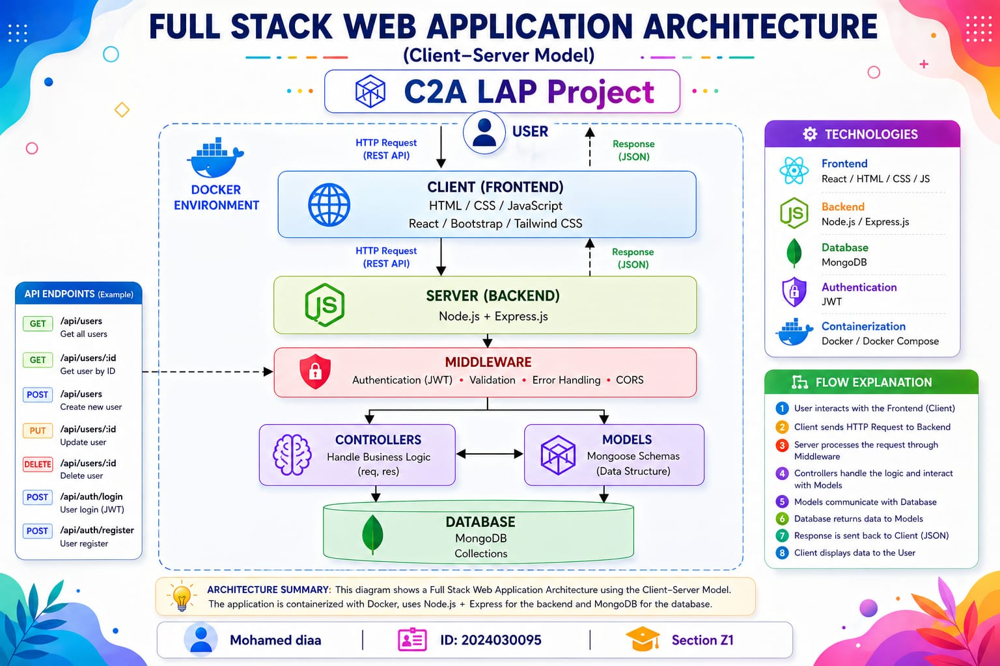
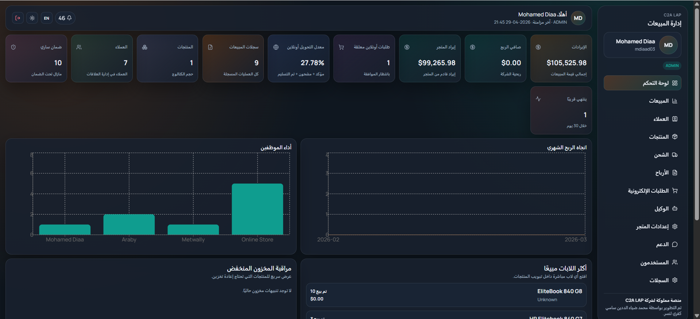
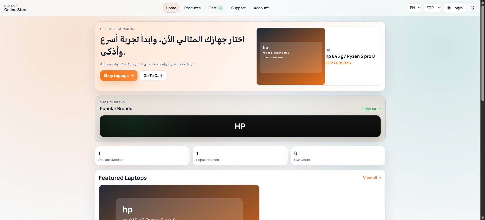

<div align="center">

# 🚀 C2A LAP — Full Stack E-commerce Dashboard & Store

### A Comprehensive Admin Dashboard and Customer Storefront

[](https://react.dev/)
[](https://nodejs.org/)
[](https://expressjs.com/)
[](https://www.mongodb.com/)

**A dual-application platform featuring an administrative dashboard for product and order management, alongside a clean, user-friendly storefront.**

**[🛒 Live Storefront Demo](https://mdiaad03-cloud.github.io/C2A-LAP-V1.1/#/store)** | **[📊 Live Dashboard Demo](https://mdiaad03-cloud.github.io/C2A-LAP-V1.1/#/admin)**

*(Note: The live demo is a frontend-only showcase. To experience full backend functionality, please run the project locally).*

</div>

---

## 🏗️ System Architecture

```text
        [ Customer ]                    [ Administrator ]
             │                                 │
             ▼                                 ▼
┌─────────────────────────┐       ┌─────────────────────────┐
│     Storefront UI       │       │      Dashboard UI       │
│    (React + Vite)       │       │     (React + Vite)      │
└────────────┬────────────┘       └────────────┬────────────┘
             │                                 │
             └───────────────┬─────────────────┘
                             ▼
                 ┌───────────────────────┐
                 │    RESTful API        │
                 │ (Node.js + Express)   │
                 └───────────┬───────────┘
                             ▼
                 ┌───────────────────────┐
                 │     Database          │
                 │     (MongoDB)         │
                 └───────────────────────┘
```



---

## 📸 Project Showcase

### 📊 Admin Dashboard
> A comprehensive control panel for managing products, categories, orders, and sales analytics.


*(See it in action: [Dashboard GIF](./docs/dashboard.gif))*

---

### 🛒 Customer Storefront
> A modern shopping experience with product catalogs, shopping cart, and seamless checkout workflow.


*(See it in action: [Store GIF](./docs/store.gif))*

---

## ✨ Key Features

| Feature | Description |
|---------|-------------|
| 🔒 **Authentication** | JWT-based secure login and registration with Role-Based Access Control (Admin vs. Customer) |
| 📦 **Product Management** | Admins can add, edit, delete, and categorize products with image uploads via Multer |
| 🛍️ **Shopping Cart** | Interactive cart management with real-time total calculation |
| 📋 **Order Tracking** | Customers can place and track orders; admins manage fulfillment statuses |
| 📈 **Sales Analytics** | Dashboard visualizes sales data and performance metrics |
| 🛡️ **Security** | API secured with Helmet, rate limiting, bcrypt password hashing, and CORS |
| 🧩 **Modular Architecture** | Clean separation of Client (React) and Server (Node/Express) codebases |

---

## ⚙️ Technology Stack

### 🎨 Frontend (Client)
- **Framework**: React 18
- **Build Tool**: Vite
- **Styling**: Tailwind CSS & Framer Motion
- **Data Fetching**: Axios
- **Routing**: React Router DOM (HashRouter)

### 🧠 Backend (Server)
- **Runtime**: Node.js
- **Framework**: Express.js
- **Authentication**: JSON Web Tokens (JWT) & bcryptjs
- **File Uploads**: Multer
- **Middleware**: Morgan (logging), Helmet (security), CORS

### 🗄️ Database
- **Primary**: MongoDB (Mongoose)
- **Fallback/Local**: JSON (lowdb) for rapid prototyping

---

## 🚀 Quick Start Guide

### Prerequisites
- [Node.js](https://nodejs.org/) (v16 or higher)
- [Git](https://git-scm.com/)
- [MongoDB](https://www.mongodb.com/) (Local installation or Atlas URI)

### 1. Clone the Repository
```bash
git clone https://github.com/mdiaad03-cloud/C2A-LAP-V1.1.git
cd C2A-LAP-V1.1
```

### 2. Install Dependencies
We provide a convenient script to install dependencies for both the client and server simultaneously:
```bash
# Windows
npm run install:all
```
*(Alternatively, you can run `npm install` inside both the `/client` and `/server` directories manually).*

### 3. Environment Setup
Create a `.env` file in the `server` directory:
```env
PORT=5000
MONGO_URI=your_mongodb_connection_string
JWT_SECRET=your_super_secret_key
```

### 4. Run the Application
Start both the React frontend and Node backend concurrently:
```bash
npm run dev
```

### 5. Access the Platform
- **Admin Dashboard**: `http://localhost:5000/admin` (or `http://localhost:5500/admin` depending on Vite config)
- **Customer Storefront**: `http://localhost:5000/store` (or `http://localhost:5500/store`)

### 🔐 Demo Credentials (Admin Panel)
Use these credentials to log in and test the dashboard locally:
- **Username:** `test`
- **Password:** `1234`

---

## 🔌 Core API Endpoints

- **`POST /api/auth/login`** — Authenticate user and return JWT
- **`GET /api/products`** — Retrieve product catalog
- **`POST /api/products`** — (Admin) Create a new product
- **`POST /api/online-orders`** — Submit a customer order
- **`GET /api/sales`** — (Admin) Retrieve sales analytics data

---

## 🛠️ Troubleshooting

- **`node` or `npm` not recognized?** Restart your terminal/PC after installing Node.js.
- **Port already in use?** Close any background applications running on ports `5000` or `5500`.
- **MongoDB connection failed?** Ensure your local MongoDB service is running or your Atlas URI is correctly formatted in the `.env` file.

---

## 👨‍💻 Author

**Mohamed Diaa El-Din Samy**
- 🎓 Badr University in Assiut
- 🆔 ID: 2024030095 | Section: Z1
- 📧 [mdiaad03@gmail.com](mailto:mdiaad03@gmail.com)
- 🐙 GitHub: [@mdiaad03-cloud](https://github.com/mdiaad03-cloud)
- 💼 LinkedIn: [Mohamed Diaa](https://www.linkedin.com/in/%D9%85%D8%AD%D9%85%D8%AF-%D8%B6%D9%8A%D8%A7%D8%A1-b43a13343)

---
<div align="center">
© 2026 Mohamed Diaa El-Din Samy. All rights reserved.
</div>
